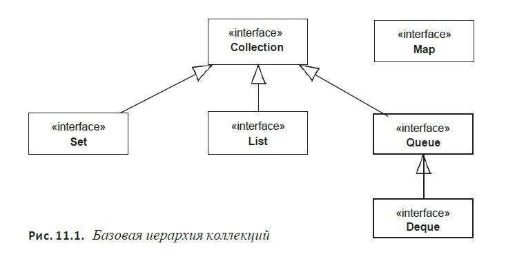
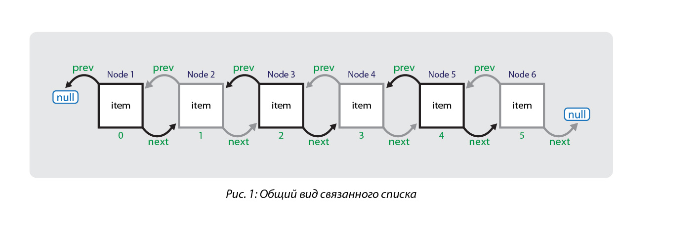

**Коллекции, что это? Поговорим о ArrayList и LinkedList**  

Коллекции в Java - это хранилища или контейнеры потдерживающие различные способы накопления и упорядочивания
объектов с целью обеспечения возможности эффективного доступа к ним.

В коллекции можно хранить объекты любого типа, кроме базовых.
Коллекции — это динамические массивы, связные списки, деревья, множества, хэштаблицы,
стеки, очереди.

**Коллекция ArrayList**  

Является самой часто используемой коллекции, по сути представляет массив который измменяет свою длину.
В основе ArrayList лежит массив типа Object[] 
Когда создаем ArrayList в его бэкграунде создается массив с размером 10 (Object[10]).
Дефолтаня вместимость списка = 10.
При добавлении элемента они складываются в след свободную ячейку, когда дефолтный массив заполняется, создается новый массив
с размером +10, при этом из старого массива все элементы переносятся в новый.
Если пофиг на пямять и нужна высокая скорость то можно создать ArrayList с указанным размером массива.
`ArrayList<String> array = new ArrayList<String>(100)` - создаст список сразу с массивом 100, тут получается что при добавлении
первых 100 элементов, джава не будет пересоздавать массив и копировать в новый данные, тем самым ускоряется работа с добавлением
элемента.  

*Устройство АррэйЛиста*

  

**Коллекция LinkedList**

Связанный список LinkedList - это звенья одной цепочки. Эти элементы хранят определенные данные, а так же
ссылки на предыдущий и следующий элементы.
Каждый элемент знает своих соседей.

При добавлении и удалении просто меняются ссылки на предыдущий и последующий элементы, в аррэй листе приходилось бы двигать все элементы при
добавлении и удалении элемента.

Недостатки:
1. Получение элемента по указанному индексу get(index) будет работать куда медленнее чем в аррэйЛист, т.к придется пройтись по всем звеньям перед тем
   как найти нужный нам элемент, в АррейЛисте это происходит гораздо быстрее

Преймущество:
1. Быстрая вставка и удаление элемента.
   Особенно стоит использовать Связанный список когда надо будет часто удалять и добавлять новые элементы, и особенно если речь идет о элементах в начале коллеции
   (в начале вообще надо будет обновить только 1 ссылку)

Но в большинстве случаев АррэйЛист будет удовлетворять всем требованиям и стоит использовать его.  

  